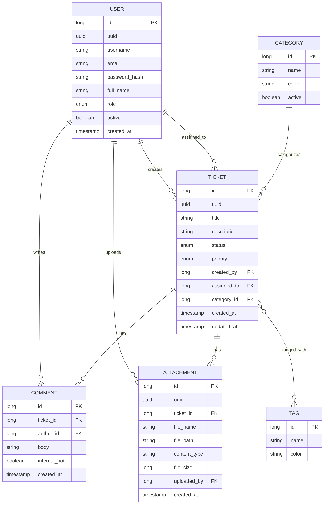

# 🎫 HelpDesk — Internal IT Ticketing System

A backend-focused internal ticketing platform built with Java, Spring Boot, Spring Security, and Spring Data JPA. Final project for the **Coding Factory** backend development bootcamp at Athens University of Economics and Business (AUEB).

---

## Overview

Internal IT support often runs on scattered emails, chat messages, and "did anyone look at this?" — with no shared record of who's responsible for what, what's actually urgent, or what happens when the person handling something is no longer available.

HelpDesk brings this into one place: employees raise tickets, support staff track and resolve them with a visible activity log and attached files, and admins manage roles and access — with the system itself surfacing work that would otherwise go unnoticed, like tickets left with someone who's since changed roles.

---

## Key Features

### Product capabilities
- **Ticket lifecycle** — create, edit, assign, comment on, and soft-delete tickets, with status (`OPEN` → `IN_PROGRESS` → `RESOLVED` → `CLOSED`) and priority tracking
- **File attachments** — upload screenshots, logs, or documents to a ticket (single or multiple at once), with server-side size and content-type validation, and soft-delete
- **Threaded activity log** — comments per ticket, with an `internal_note` flag for staff-only notes not visible to the requester
- **Dynamic filtering & search** — filter tickets by status/priority, search by title, with pagination
- **Tagging** — free-form labels (`hardware-repair`, `network-wifi`, `password-reset`, `access-request`, `os-update`, `onboarding`, `recurring`) independent of the structured `Category` field, for cross-cutting classification
- **Dashboard** — live counts by status and priority, per-agent workload, recent activity
- **Home page stats scoped by role** — a plain `USER` sees counts for their own tickets only, matching what they see in the ticket list; `ADMIN`/`SUPPORT` see company-wide counts, consistent with their broader view everywhere else in the app
- **Admin panel** — manage users: change role, enable/disable accounts

### Security & access control
- **Session-based authentication** — Spring Security, BCrypt password hashing
- **Authentication audit trail** — custom `AuthenticationSuccessHandler`/`AuthenticationFailureHandler` log every login attempt (username, outcome, source IP) via SLF4J
- **Role-based access** — three roles (`ADMIN`, `SUPPORT`, `USER`), enforced both in the UI and server-side
- **Field-level authorization** — a ticket's creator can edit its own content, but status and assignment changes are silently ignored unless the caller is staff — a deliberate alternative to method-level `@PreAuthorize` where blocking the whole action would be wrong
- **Scoped visibility** — plain `USER` accounts only ever see their own tickets and their own stats, enforced via a Specification predicate (list) and role-conditional queries (home page) at the query level, not just hidden in the UI
- **UUID-based public identifiers** — internal auto-increment IDs are never exposed in URLs or views
- **Path-traversal defense on file uploads** — uploaded filenames are stripped to their base name and prefixed with a fresh UUID before being written to disk; the resolved path is double-checked against the upload directory before every write
- **Non-root database access** — the app connects as a dedicated MySQL user scoped to its own database, not `root`; all DB credentials are externalized via environment variables with local-dev fallbacks, never hardcoded

### Technical foundations
- **Layered service architecture** — Controller → Service → Repository, with DTOs decoupling the view layer from JPA entities
- **Flyway migrations** — all schema changes are versioned; no `ddl-auto`
- **Spring Profiles** — `application.properties` holds shared config; environment-specific settings (currently the MySQL connection) live in `application-dev.properties`, activated via `spring.profiles.active=dev`
- **Specification API** — dynamic, composable query predicates for filtering, combined with role-based scoping
- **N+1 avoidance** — `@EntityGraph` on hot-path queries (ticket list, ticket detail)
- **Structured logging** — SLF4J/Logback with rolling, size-bounded file appenders separated by concern (application, errors, SQL, connection pool, embedded server), not just console output

---

## Architecture Notes

**Orphaned & unassigned ticket detection.** If a `SUPPORT` agent is demoted to `USER` or **disabled** while they still have active tickets assigned to them, those tickets don't automatically get reassigned — they'd otherwise sit invisible, since the Agent Workload widget only counts current, *active* `SUPPORT` staff. A dedicated JPQL query (`findOrphanedTickets`) catches both cases — role mismatch *or* a disabled account — and surfaces them on the dashboard so an admin can reassign them, alongside a separate check for tickets that were never assigned to anyone at all.

**Conditional reassignment reason.** Reassigning a ticket that already has an owner requires a short comment explaining why — this matters for accountability when responsibility changes hands. First-time assignment of a previously unassigned ticket doesn't require one, since there's nothing to explain yet. The rule is enforced both as a form constraint in the view and, more importantly, as validation in the service layer, which records the outcome as an automatic internal comment on the ticket.

**Attachments as filesystem + metadata, not DB blobs.** Files are written to a configurable local directory (`app.upload-dir`); only the path, filename, content type, and size live in MySQL. Storing file bytes directly in the database was ruled out as the wrong level of complexity here — cloud object storage (S3-compatible) would be the natural next step if this needed to run across multiple app instances, but is overkill for a single-instance internal tool.

**Timestamps in UTC.** All entity timestamps use `Instant` rather than `LocalDateTime`, to avoid timezone-dependent inconsistencies between the application server and the database.

**Unchecked exceptions + centralized handling, by design.** Custom domain exceptions (`TicketNotFoundException`, etc.) extend `RuntimeException`, not `Exception`, and are caught in one place (`GlobalExceptionHandler`) rather than declared with `throws` and handled per-controller-method. This is a deliberate departure from a more traditional checked-exception style: it keeps method signatures clean, avoids exception types "leaking" through every layer that touches them, and matches how Spring's own exception hierarchy is designed (e.g. `DataAccessException` wraps the checked `SQLException` precisely to avoid this). The trade-off is that a not-found error currently redirects to a dedicated error page rather than re-rendering the original form with field values intact — acceptable here since the one place that matters most for that (ticket creation) already handles its own errors locally instead of relying on the global handler. A final, catch-all `Exception` handler renders a generic 500 page for anything unanticipated (logging the full stack trace server-side but never exposing internals to the client); `NoResourceFoundException` — the routine "browser asked for a favicon that doesn't exist" case — is matched separately ahead of it, so it resolves quietly as a 404 instead of being logged as an unexpected error.

**RESOLVED vs. CLOSED is not currently a strictly enforced workflow.** Both are treated as "the problem is handled" for reporting purposes (the dashboard's "resolved today" count includes either status), but the codebase doesn't currently restrict *who* can move a ticket from `RESOLVED` to `CLOSED` or enforce that order over jumping straight to `CLOSED`. In a real deployment, `CLOSED` would typically be a later, separate step — e.g. confirmed by the original requester, or auto-closed after a period of inactivity — while `RESOLVED` just means staff believe the fix is in place. Left unenforced here deliberately, as a known scope boundary rather than an oversight.

---

## Entity-Relationship Diagram



---

## Technical Stack

**Java** · **Spring Boot** · **MySQL** · **Docker**

| Layer | Technology |
|---|---|
| Language | Java 21 |
| Framework | Spring Boot 4.0.7 |
| Security | Spring Security (session-based, BCrypt) |
| Data persistence | Spring Data JPA / Hibernate, MySQL 8, Flyway |
| Validation | Jakarta Bean Validation |
| Logging | SLF4J / Logback (rolling file appenders) |
| Frontend | Thymeleaf (server-side rendering) |
| Build tool | Gradle |
| Testing | JUnit 5, Mockito |
| Containerization | Docker, Docker Compose |

---

## Development Setup

### Prerequisites
- Git
- Java 21 (JDK)
- Docker & Docker Compose

### Run locally

```bash
git clone https://github.com/mstampelou/helpdesk.git
cd helpdesk

# start MySQL
docker-compose up -d

# build and run the app
./gradlew clean bootRun
```

The app starts on **http://localhost:8080** with the `dev` Spring profile active. Flyway runs all migrations automatically on startup.

### Demo accounts

All demo accounts use the password `password123`.

| Username | Role |
|---|---|
| `admin.demo` | ADMIN |
| `james.support` | SUPPORT |
| `maria.support` | SUPPORT |
| `user.demo` | USER |
| `nina.user` | USER |

### Database credentials

Both the application and the Docker MySQL container read credentials from environment variables, falling back to local-dev defaults so the project runs out of the box:

```bash
export DB_USERNAME=your_user       # app → MySQL
export DB_PASSWORD=your_password
export MYSQL_ROOT_PASSWORD=...     # docker-compose → MySQL root bootstrap
export MYSQL_PASSWORD=...          # docker-compose → app user bootstrap
```

### File uploads

Attachments are written to `./uploads` by default (configurable via `app.upload-dir` in `application-dev.properties`). This directory — along with `logs/` — is git-ignored; neither uploaded files nor rolling log output are meant to live in version control.

---

## Known Design Decisions

- **Category/Tag management is seed-data-driven**, not exposed through an admin CRUD screen — adding a new tag means a new Flyway migration rather than a UI action. A reasonable trade-off at this scale; the first thing to build out with an admin screen if this grew further.
- **Tags and Priority are intentionally separate.** A tag like a hypothetical `urgent` label wouldn't duplicate `priority` — priority reflects business impact set at creation, while tags are free-form labels that can be added at any time, similar to the distinction between Jira's *labels* and *components*.
- **Comments are immutable** — no edit/delete on individual comments, to keep the activity log a reliable record of what happened. Attachments *can* be soft-deleted, since removing a mistakenly-uploaded file doesn't compromise the log the way editing a comment would.
- **No self-service registration** — accounts are provisioned via seed data / admin action, matching how internal helpdesk tools are typically set up.
- **Unchecked exceptions over checked** — see *Architecture Notes* above.
- **RESOLVED vs. CLOSED workflow is not enforced** — see *Architecture Notes* above.

---

## Testing

Unit tests (JUnit 5 + Mockito) cover the service layer, plus one repository-level integration test:

- **`TicketServiceImplTest`** — the most complex service: ticket creation and its validation path, field-level authorization in `updateTicket()` (owner vs. staff vs. unrelated user), `assignTicket()`'s conditional reassignment-reason validation (verified with `ArgumentCaptor` against the resulting comment content), soft-delete, and scoped `findPaginated()` behavior
- **`UserServiceImplTest`** — role changes and account activation toggling
- **`DashboardServiceImplTest`** — orphaned/unassigned ticket queries map correctly to DTOs
- **`AttachmentServiceImplTest`** — file size and content-type validation reject invalid uploads before touching the filesystem or database; a valid upload is written to a real temp directory (`@TempDir`) and persisted correctly
- **`TicketRepositoryTest`** (`@DataJpaTest`) — the only tier that runs against a real database (H2, MySQL-compatible mode) rather than mocks, verifying the actual JPQL behind `findOrphanedTickets` (both the demoted-role and disabled-account branches) and the unassigned-ticket query

```bash
./gradlew test
```

---